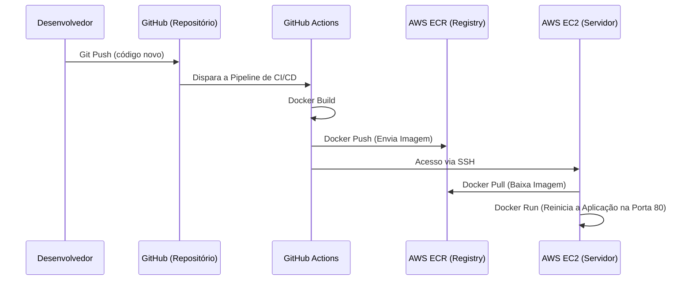

# ⛽ Fuel App - DevOps CI/CD Pipeline

   

> Uma aplicação web conteinerizada, focada em demonstrar práticas modernas de DevOps. A aplicação realiza o cálculo de gastos de combustível para viagens, mas o objetivo principal do projeto é demonstrar a **Infraestrutura (AWS)** e o **Pipeline de Integração/Entrega Contínuas (CI/CD)**.

## 🏗️ Arquitetura e Fluxo de CI/CD

O fluxo de implantação é totalmente automatizado. Ao realizar um *push* na branch `main`, o GitHub Actions assume o controle do *build*, registro da imagem e *deploy* direto no servidor de produção através do arquivo `deploy.yml`.



## 🚀 Tecnologias Utilizadas

**Infraestrutura e DevOps:**
- **Docker:** Imagem baseada em **Alpine Linux** configurada no `Dockerfile` para garantir um container extremamente leve[cite: 1].
- **AWS ECR (Elastic Container Registry):** Armazenamento privado das imagens.
- **AWS EC2 (Elastic Compute Cloud):** Servidor de produção.
- **GitHub Actions:** Automação da pipeline.

**Aplicação Base:**
- HTML5 (`index.html`), CSS3 (`style.css`) e JavaScript puro, arquitetado de forma modular usando `main.js`, `calculo.js` e `ui.js.

## 🔐 Configuração do Pipeline (Secrets)

Para o GitHub Actions orquestrar o deploy na AWS, as seguintes variáveis estão configuradas:
- `AWS_ACCESS_KEY_ID` & `AWS_SECRET_ACCESS_KEY`
- `AWS_REGION`
- `ECR_REPOSITORY`
- `EC2_HOST` & `EC2_USER`
- `EC2_SSH_KEY`

## 💻 Como executar o projeto localmente

1. Clone o repositório:
```bash
git clone https://github.com/matheus98sto-stack/calculo-combustivel.git
cd calculo-combustivel
```

2. Faça o build da imagem Docker:
```bash
docker build -t fuel-app-local .
```

3. Execute o container:
```bash
docker run -d -p 8080:80 fuel-app-local
```

Acesse `http://localhost:8080` no seu navegador.

---
Desenvolvido por **Matheus Oliveira**
- LinkedIn: [in/matheus-santos-de-oliveira-474139197](https://www.linkedin.com/in/matheus-santos-de-oliveira-474139197/)
- GitHub: [matheus98sto-stack](https://github.com/matheus98sto-stack)
